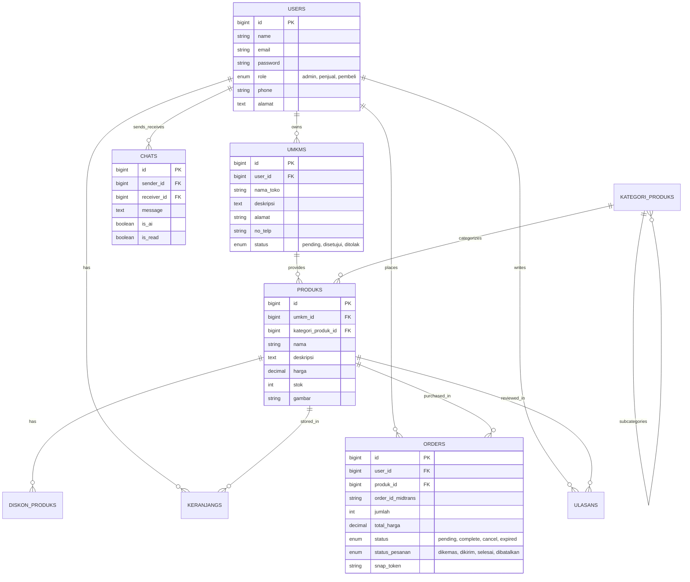

<div align="center">

# 🥭 Juragan Pelem — Agro-Commerce Indramayu
### Platform Digital E-Commerce & Marketplace UMKM Agrikultur Terintegrasi

[](https://laravel.com)
[](https://php.net)
[](https://tailwindcss.com)
[](https://midtrans.com)
[](https://pusher.com)
[](https://ai.google.dev)
[](LICENSE)

<p align="center">
  <strong>Menghubungkan petani mangga unggulan & pelaku UMKM Kabupaten Indramayu langsung ke konsumen seluruh Indonesia secara transparan, realtime, dan aman.</strong>
</p>

[Fitur Utama](#-fitur-utama) •
[Arsitektur & Tech Stack](#-arsitektur--tech-stack) •
[Instalasi & Setup](#-panduan-instalasi--setup-lokal) •
[Struktur Database](#-struktur-database--relasi-erd) •
[Akun Demo](#-akun-demo-pengujian) •
[Keamanan & Audit](#-standar-keamanan--audit)

---

</div>

## 📖 Tentang Platform

**Juragan Pelem** adalah solusi ekosistem *agro-commerce* dan marketplace multi-vendor yang didedikasikan untuk memajukan komoditas agrikultur khas Kabupaten Indramayu (khususnya Mangga Gedong Gincu, Harum Manis, Cengkir, serta produk olahan turunan seperti sirup, dodol, dan keripik mangga).

Platform ini dilengkapi dengan fitur transaksi multi-toko (*unified cart checkout*), integrasi payment gateway resmi berstandar PCI-DSS (Midtrans Snap), sistem *live search* autocomplete cerdas, manajemen inventaris *realtime*, chatbot asisten virtual berbasis Google Gemini AI, serta antarmuka responsif dengan *mobile app-like navigation dock*.

---

## ✨ Fitur Utama

### 🛍️ 1. Pengalaman Belanja & Katalog Interaktif (Pembeli)
- **Live Search & Autocomplete**: Pencarian produk, UMKM, dan kategori dengan *debounce* instan tanpa reload halaman.
- **Filter Katalog AJAX Dinamis (`/kategori`)**: Filter kategori, rentang harga, dan sorting produk dengan *smooth transition* dan *browser pushState*.
- **Unified Multi-Store Cart**: Beli berbagai produk dari beberapa UMKM berbeda dalam satu kali pembayaran Midtrans.
- **Realtime Stepper Cart**: Penyesuaian jumlah item (`[-] [qty] [+]`) dengan kalkulasi instan subtotal, validasi stok dinamis, dan hapus baris halus (*animated fade-out*).
- **Live Subtotal di Halaman Detail**: Perhitungan harga otomatis saat mengubah kuantitas pada halaman produk (`/produk/{id}`).
- **Tracking Pesanan & Status Pembayaran**: Pantau status pesanan (*Belum Bayar*, *Dikemas*, *Dikirim*, *Selesai*) dengan fitur cetak invoice resmi.
- **Rating & Ulasan Produk**: Pembeli dapat memberikan penilaian bintang dan testimoni setelah pesanan diterima.

### 🏪 2. Manajemen Toko & Penjualan (Penjual / Mitra UMKM)
- **Pendaftaran & Profil UMKM**: Registrasi toko dengan verifikasi administratif oleh Admin.
- **Katalog Produk & Diskon Berjangka**: Pengelolaan produk, stok, variasi gambar, dan promosi diskon dengan tanggal berlaku otomatis.
- **Pesanan Masuk & Manajemen Pengiriman**: Pemrosesan order, input nomor resi, dan pembaruan status logistik.
- **Laporan Finansial & Pendapatan**: Rekapitulasi omzet penjualan per produk, total pendapatan bersih, dan riwayat pesanan.
- **Invoice PDF Otomatis**: Generate dan unduh invoice resmi format PDF untuk setiap transaksi pelanggan (didukung DomPDF).

### ⚙️ 3. Kontrol Pusat & Tata Kelola (Administrator)
- **Executive Analytics Dashboard**: Metrik *real-time* GMV (Gross Merchandise Value), total transaksi, grafik pertumbuhan pengguna, dan performa kategori.
- **Manajemen Verifikasi UMKM**: Tinjau, setujui, atau tolak pendaftaran toko mitra baru.
- **Manajemen Kategori Berjenjang**: Pengaturan taksonomi kategori induk dan sub-kategori produk.
- **Manajemen Akun Terpadu**: Monitoring aktivitas seluruh penjual dan pembeli terdaftar.

### 💬 4. Komunikasi Realtime & AI Assistant
- **Chat Realtime (Pusher / WebSocket)**: Komunikasi dua arah langsung antara pembeli dan pemilik UMKM dengan status baca (*is_read*) dan notifikasi badge instan.
- **Asisten AI Terintegrasi (Google Gemini)**: Layanan bantuan pelanggan otomatis 24/7 untuk menjawab pertanyaan seputar jenis mangga, rekomendasi olahan, dan panduan transaksi.

### 📱 5. Antarmuka Mobile-First
- **App-Like Floating Navigation Dock**: Menu navigasi bawah bergaya aplikasi native untuk perangkat *smartphone*.
- **Desain Modern & Terkurasi**: Tipografi harmonis, *smooth gradients*, *glassmorphism*, dan *micro-interactions*.

---

## 🛠 Arsitektur & Tech Stack

| Layer | Teknologi | Deskripsi |
|---|---|---|
| **Backend Framework** | Laravel 10 / 11 | Arsitektur MVC, Eloquent ORM, Service Layer, Middleware Security |
| **Language** | PHP 8.2+ | Strong Type Hinting, Performance Optimization |
| **Database** | MySQL 8.0+ / MariaDB | Relational schema dengan Foreign Key Constraints & DB Locking |
| **Frontend Styling** | Tailwind CSS 3.x | Utility-first responsive design, custom palette |
| **Realtime Engine** | Pusher WebSockets & Laravel Echo | Broadcasting event obrolan langsung & sinkronisasi notifikasi |
| **Payment Gateway** | Midtrans Snap (Sandbox & Production) | Multi-channel payment (Virtual Account, QRIS, GoPay, Card) |
| **Artificial Intelligence**| Google Gemini API | Asisten konsultasi produk agrikultur otomatis |
| **Document Generator**| Barryvdh DomPDF | Rendering invoice format PDF berkualitas tinggi |
| **Mobile App** | Flutter 3.x (Folder `mobile/`) | Mobile client untuk iOS dan Android |

---

## 📊 Struktur Database & Relasi (ERD)



---

## 🚀 Panduan Instalasi & Setup Lokal

### 📋 Prasyarat Sistem
- PHP >= 8.2 (dengan ekstensi `pdo`, `mbstring`, `openssl`, `curl`, `gd`, `fileinfo`)
- Composer >= 2.x
- Node.js >= 18.x & NPM
- MySQL Server >= 8.0

### 🔧 Langkah Demi Langkah

#### 1. Clone Repository
```bash
git clone https://github.com/yaaeww/ecommerce.git
cd ecommerce
```

#### 2. Install Dependensi PHP & JavaScript
```bash
composer install
npm install
```

#### 3. Konfigurasi Environment File
Salin file konfigurasi contoh dan generate Application Key:
```bash
cp .env.example .env
php artisan key:generate
```

#### 4. Pengaturan Database & API Keys
Buka file `.env` dan sesuaikan kredensial Anda:
```env
APP_NAME="Juragan Pelem"
APP_URL=http://127.0.0.1:8000

DB_CONNECTION=mysql
DB_HOST=127.0.0.1
DB_PORT=3306
DB_DATABASE=ecommerce_db
DB_USERNAME=root
DB_PASSWORD=

# Konfigurasi Midtrans Payment Gateway
MIDTRANS_SERVER_KEY=SB-Mid-server-xxxxxxxxxxxxxxxxx
MIDTRANS_CLIENT_KEY=SB-Mid-client-xxxxxxxxxxxxxxxxx
MIDTRANS_IS_PRODUCTION=false

# Konfigurasi Pusher (Realtime Chat)
BROADCAST_DRIVER=pusher
PUSHER_APP_ID=your_app_id
PUSHER_APP_KEY=your_app_key
PUSHER_APP_SECRET=your_app_secret
PUSHER_APP_CLUSTER=ap1

# Konfigurasi Google Gemini AI
GEMINI_API_KEY=your_google_gemini_api_key
```

#### 5. Jalankan Migrasi & Database Seeder
```bash
php artisan migrate:fresh --seed
php artisan storage:link
```

#### 6. Jalankan Server Pengembangan
Jalankan dev server Laravel dan Vite asset compiler:
```bash
# Terminal 1 (Laravel Web Server)
php artisan serve

# Terminal 2 (Vite Frontend Watcher)
npm run dev
```
Akses aplikasi melalui browser di **`http://127.0.0.1:8000`**.

---

## 🔐 Akun Demo Pengujian

Setelah menjalankan `php artisan db:seed`, Anda dapat langsung menggunakan akun demo default:

| Role | Email | Password | Hak Akses Utama |
|---|---|---|---|
| 👑 **Administrator** | `admin@gmail.com` | `password` | Manajemen UMKM, Kategori, Verifikasi Toko, Analytics Dashboard |
| 🏬 **Penjual (UMKM)** | `penjual@gmail.com` | `password` | Tambah Produk, Diskon, Kelola Pesanan Masuk, Cetak Invoice PDF |
| 🧑 **Penjual (UMKM 2)** | `jo@gmail.com` | `password` | Mitra Toko Olahan Mangga |
| 🛒 **Pembeli (Customer)**| `budi@gmail.com` | `password` | Checkout Midtrans, Keranjang Multi-Store, Chat Penjual & AI |
| 🛒 **Pembeli (Customer 2)**| `pembeli@gmail.com` | `password` | Riwayat Pembelian, Ulasan Produk, Tracking Order |

---

## 🛡️ Standar Keamanan & Audit

Aplikasi ini telah melalui pengerasan keamanan tingkat tinggi (*Security Hardening*):
1. **Perlindungan IDOR (Insecure Direct Object Reference)**:
   - Validasi kepemilikan data pada endpoint invoice, riwayat transaksi, dan modul modifikasi produk penjual.
2. **Idempotensi & Transaksi Atomik Webhook Midtrans**:
   - Menghindari duplikasi pemotongan stok pada saat penerimaan callback berulang (*replay attack*) menggunakan transaksi `DB::transaction()` dan `lockForUpdate()`.
3. **Pencegahan Eksploitasi Stok Negatif**:
   - Validasi kuantitas berlapis di sisi server sebelum inisialisasi pembayaran Snap Midtrans.
4. **Proteksi Akses Role & Escalation Guard**:
   - Endpoint registrasi publik dilindungi terhadap *role tampering* (hanya mengizinkan registrasi role `penjual` dan `pembeli`).
5. **Mitigasi XSS & Payload Sanitization**:
   - Seluruh konten ulasan, nama produk, dan obrolan disanitasi menggunakan auto-escape Blade serta fungsi proteksi pada JavaScript DOM insertion.
6. **Rate Limiting (Throttle Middleware)**:
   - Pembatasan frekuensi request pada endpoint sensitif (`/login`, `/register`, dan `/chat/send`) untuk mencegah brute force dan spamming.

---

## 📂 Struktur Direktori Proyek

```plaintext
ecommerce/
├── app/
│   ├── Events/                  # Broadcasting Realtime Chat Events
│   ├── Http/
│   │   ├── Controllers/
│   │   │   ├── Admin/           # Controller Khusus Role Administrator
│   │   │   ├── Auth/            # Modul Autentikasi & Role Selection
│   │   │   ├── Pembeli/         # Checkout, Keranjang, Pesanan, Rating
│   │   │   ├── Penjual/         # UMKM, Produk, Diskon, Pesanan Masuk
│   │   │   ├── User/            # Modul Chat Pembeli & Gemini AI
│   │   │   └── LandingController.php # Beranda, Live Search, Katalog
│   │   └── Middleware/          # Role Verification, CSRF Exemption
│   ├── Models/                  # Eloquent Database Models
│   └── Services/                # Gemini AI Service & Helper Integrations
├── config/                      # Konfigurasi Midtrans, Database, Services
├── database/
│   ├── migrations/              # Definisi Skema Tabel Database
│   └── seeders/                 # Data Dummy Awal Komprehensif
├── mobile/                      # Sub-proyek Aplikasi Mobile Flutter
├── public/                      # Static Assets (Images, Icons, CSS)
├── resources/
│   └── views/
│       ├── admin/               # Blade Views Dashboard Admin
│       ├── auth/                # Tampilan Login, Register, Forgot Password
│       ├── layouts/             # Master Layouts (Public, Dashboard App)
│       ├── partials/            # Header, Footer, Bottom Dock, Sidebars
│       ├── pembeli/             # Views Khusus Pembeli (Checkout, Order, Chat)
│       └── penjual/             # Views Khusus Mitra Toko UMKM
└── routes/
    ├── api.php                  # REST API Endpoints & Midtrans Webhook
    ├── auth.php                 # Rute Autentikasi Laravel Breeze
    └── web.php                  # Web Routing Berdasarkan Role User
```

---

## 🤝 Kontribusi & Pengembangan

Kami menyambut kontribusi untuk pengembangan ekosistem **Juragan Pelem**:
1. *Fork* repository ini.
2. Buat branch fitur baru (`git checkout -b feature/FiturKeren`).
3. Lakukan commit perubahan (`git commit -m 'feat: Menambahkan fitur filter baru'`).
4. *Push* ke branch Anda (`git push origin feature/FiturKeren`).
5. Buat *Pull Request* baru.

---

## 📄 Lisensi

Proyek ini dilisensikan di bawah lisensi **[MIT License](LICENSE)**.

---

<div align="center">
  <sub>Dikembangkan dengan ❤️ untuk kemajuan Agrikultur & UMKM Kabupaten Indramayu.</sub>
</div>
